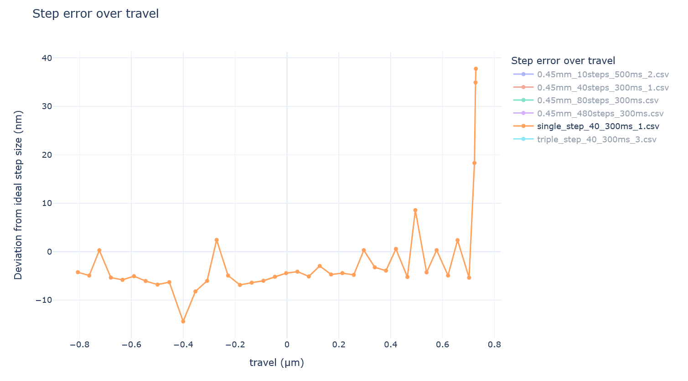

# Flexure-Based Positioning System: Measurement and Analysis

## 1. System Overview

This document describes a precision positioning system using a 
flexure-based mechanism for high-precision motion control. 
The system leverages mechanical design principles to achieve 
nanometer-scale positioning accuracy.

## 2. Hardware Configuration

The positioning system consists of:

- **Flexure mechanism**: Provides linear motion without backlash and stick-slip
- **Micrometer drive**: 0.5 mm pitch precision screw
- **Stepper motor**: 200 steps per revolution
- **Microstepping driver**: 64 microsteps per full step
- **Control electronics**: Arduino-based motion controller + TMC2209 stepper driver
- **Measurement system**: MicroEpsilon DL6220 with 500µm range CSH05 Capacitive Sensor

## 3. Technical Specifications

The mechanical configuration yields the following parameters:

| Parameter | Value | Calculation |
|-----------|-------|-------------|
| Steps per revolution | 12,800 | 200 steps × 64 microsteps |
| Linear movement per revolution | 500 μm | 0.5 mm pitch |
| Steps per micrometre | 25.6 | 12,800 ÷ 500 |
| Resolution | 39.0625 nm/step | 1000 ÷ 25.6 |

## 4. Measurement Protocols

Several movement patterns were analyzed:

| Measurement | Travel Distance | Step Count | Standstill Time | Notes |
|-------------|----------------|------------|-----------------|-------|
| 10-step protocol | 0.45 mm | 10 | 500 ms          | Larger individual steps |
| 40-step protocol | 0.45 mm | 40 | 300 ms          | Medium steps |
| 80-step protocol | 0.45 mm | 80 | 300 ms          | Small steps |
| 480-step protocol | 0.45 mm | 480 | 300 ms          | Micro steps |
| Single-step movements | - | 40 × 1 | 300 ms          | Individual step analysis |
| Triple-step movements | - | 40 × 3 | 300 ms          | Small group movement |

## 5. Data Acquisition

- **Sampling frequency**: 520.83 Hz
- **Data format**: CSV files with timestamps and position measurements
- **Measurement method**: Window extraction approach:
  - Defined time windows after position stabilization
  - Find offset and window size
  - Stable position calculated as window average

## 6. Analysis

The analysis pipeline includes:

1. **Window Extraction**:
   - Temporal isolation of stable position periods
   - Configurable parameters for window offset and size

2. **Linearity Analysis**:
   - Comparison of actual vs. expected positions
   - Linear regression to quantify performance
    
   - Bad linearity (about 6% deviation)

3. **Step Size Deviation Analysis**:
   - Evaluation of step-to-step consistency
   - Measurement of absolute deviations
   
   - deviation gets smaller the smaller the steps are (sort of logical)
   
   - even at 39nm steps the deviation is about 5nm on average. Weird. That is about 12% off from what is should be. Could be a particularly bad spot in the linearity of the screw or motor tho.